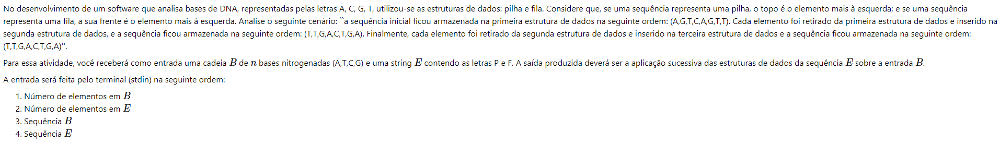
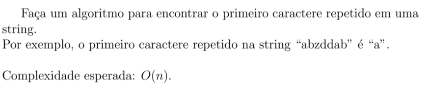
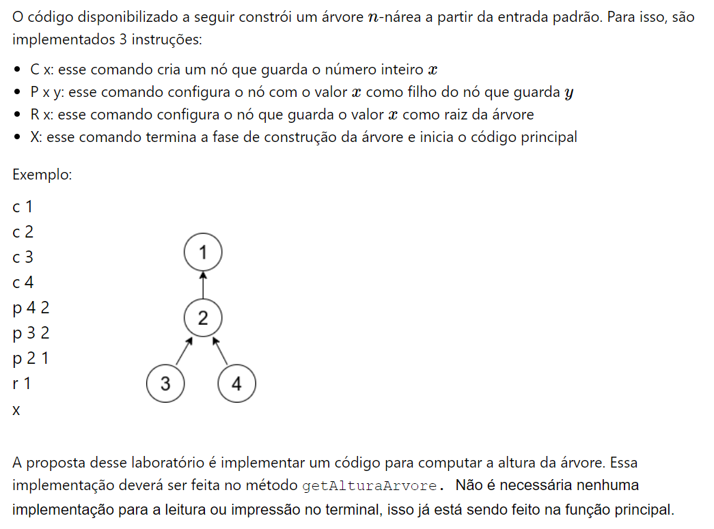
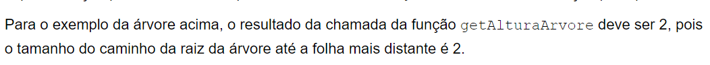

# Data-Structure-Exercises
💻Exercises completed with Java language.

⚠️Some exercises may be written in Portuguese-BR, please use google translator if you need.

# Exercícios-de-Estrutura-de-Dados
💻Exercícos realizados com a linguagem Java.

---

# Lab 01

Implementar a classe ListaOrdenada. Atenção: compare bem a saída esperada com o resultado do seu código antes de submeter.
Métodos:
public boolean insere(int valor):Insere um valor na lista de forma **ordenada** e retorna true em caso de sucesso, false em caso de fracasso.
public boolean remove(int idx)remove um item da lista que está na **posição idx** e retorna true em caso de sucesso, false em caso de fracasso.

---

# Lab 02

Implementar os métodos remove e busca da LDE.
public boolean remove(int idx):  deve remover o nó que está na posição *idx* da lista. Dessa forma, a chamada l.remove(1)  deve remover o nó de índice 1 (o segundo).
public int busca(int valor): recebe um valor que deve ser buscado na lista e retorna o índice (posição) de onde está o valor.

---

# Lab 03

Implementar a LDDE. Não alterar a classe Main

---

# Lab 04

Implementar o método elementoCentral. Esse método deverá encontrar o nó que se encontra no meio de uma lista encadeada. Caso a lista tenha tamanho par,
deverá retornar o elemento à esquerda mais próximo do centro da lista.

---

# Lab 05

Implementar métodos insere e remove da fila encadeada.

---

# Lab 06

Implementar métodos insere e remove da pilha encadeada.

---

# Lab 07

  

---

# Lab 08

Implementar métodos da classe Heap

---

# Lab 09

Implementar a classe HashTable

---

# Lab 10

  

---

# Lab 11

  

  

---

# Lab 12

Implementar métodos Insere e Busca.

---

# Lab 13

Implementar método remove

---

# Lab 14

Completar código da Árvore Binária de Busca Balanceada

